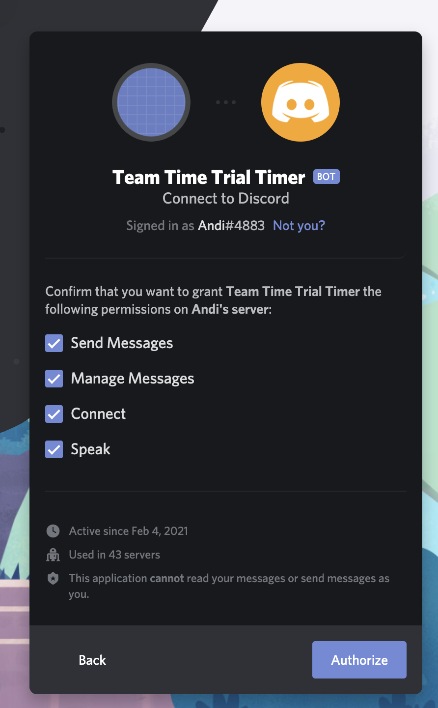

# TTT-Timer Discord Bot

This discord bot was built for virtual team time trials on [Zwift](https://zwift.com/) organized by [WTRL](https://www.wtrl.racing/). It takes the position of the DC and announces who has to lead next and for how long. Of course, the bot is not a replacement for a real coach but helps you to stay organized during an exhausting team time trial. The bot joins the discord call with your team mates and gives voice commands to everyone.

This is a follow-up project of the [TTT-Timer Web App](https://andipaetzold.github.io/tttt/).

## Installation

Click [here](https://discord.com/api/oauth2/authorize?client_id=806979974594560060&permissions=3155968&scope=bot+applications.commands) to install the bot to your server

You will be asked to grant multiple permissions:

| Permission      | Description                                                                                                                                                |
| --------------- | ---------------------------------------------------------------------------------------------------------------------------------------------------------- |
| Send Messages   | Allows the bot to send messages to a text channels                                                                                                         |
| Manage Messages | Allows the bot to update other users messages. This is used to create a button-like behavior when clicking on the emojis below the timer's status message. |
| Connect         | Allows the bot to join a voice channel                                                                                                                     |
| Speak           | Allows the bot to send audio / voice to a voice channel                                                                                                    |



## Usage

-   All commands are case insensitive to avoid frustration when interacting with the bot during a race.
-   There is only 1 configuration for each server. Changing the configuration in different text channels using the commands below, will alter the same configuration.

### Documentation Syntax

| Syntax               | Meaning                                                                                                                                                                          |
| -------------------- | -------------------------------------------------------------------------------------------------------------------------------------------------------------------------------- |
| `<name>` or `<time>` | These are command options that you can individually define. Replace these options including the `<` and `>` with your specific configuration.                                    |
| `[<name>]`           | Angle brackets represent optional options. These may be left out and either lead to a different behaviour or a fallback value will be used                                       |
| `@Andi`              | Used in the examples to represent [Discord mentions](https://discordia.me/en/mentions). Do not actually send the `@` symbol but use the GitHub client to select a specific user. |

### Commands

#### `/timer athlete <athlete> <time>`

Set the lead time of an athlete. The user must be added to the athletes list before using the `/timer athletes` command.
You can also mention a user instead of typing their name.

Example:

```bash
/timer athlete Andi 45

// or

/timer athlete @Andi 45
```

_Sets the lead time of Andi to 45 seconds_

#### `/timer athletes [<athlete1>] [<time1>] [<athlete2>] [<time2>] ...`

If all options are omitted, returns the configured athletes.

Otherwise, sets the list of athletes in the team and their lead times. The lead times are optional and default to 30 seconds.

You can also mention a user instead of typing their name. The voice commands will use the username at the time of sending this command, so make sure to change it to something pronouncable.

Examples:

```bash
/timer athletes Andi:45 Victor

// or

/timer athletes @Andi:45 Victor
```

_The team now includes Andi and Victor. Andi leads for 45 seconds, Victor for 30._


#### `/timer delay [<time>]`

If `<time>` is omitted, returns the configured start delay

Otherwise, sets the start delay in seconds.

Example:

```bash
/timer delay 300
```

_The timer will wait for 5 minutes before giving commands_

#### `/timer fresh [<athlete>]`

The athlete won't be skipped anymore. If the user sending this command was mentioned when configuring the timer the name can be omitted. This command doesn't change the order of the athletes.

Examples:

```bash
/timer fresh Andi
```

_Andi will join the lead rotation again_

```bash
/timer fresh
```

_If the user sending this message was mentioned when configuring the timer, they will join the lead rotation again_

#### `/timer language [<language>]`

If `<language>` is omitted, the bot replies with the configured language.

Otherwise, sets the language of the voice commands. Available languages are:

-   English (`/timer language en`)
-   German (`/timer language de`)
-   Czech (`/timer language cz`)

#### `/timer toast [<athlete>]`

The athlete is skipped until writing `/timer fresh [<name>]`. If the mentioned athlete is currently leading, the remaining time is skipped and the next athlete is announced with "Go &lt;name&gt;".

If the user sending this command was mentioned when configuring the timer the name can be omitted. This command doesn't change the order of the athletes.

Example:

```bash
/timer toast Andi
```

_Andi is ignored when the bot announces the next leading athlete_

```bash
/timer fresh
```

_If the user sending this message was mentioned when configuring the timer, they will be ignored when the bot announces the next leading athlete_

#### `/timer help`

Shows help message


#### `/timer plus <time>`

Adds time to the timer of the currently leading athlete. This is temporary and on the next rotation, the athlete will do their previously configured lead time again.

Example:

```bash
/timer plus 15
```

_Adds 15 seconds to the clock of the currently leading athlete_

#### `/timer reset`

Stops the timer and resets all configuration of the bot for your server.

#### `/timer skip`

The remaining time of the current athlete is skipped and the next athlete is announced with "Go &lt;name&gt;". This is a one-time skip.

If the timer hasn't started yet and is still waiting for the start delay to tick down, this command will skip the remaining time and immediately start the race with the first athlete.

#### `/timer start`

Starts the timer. The bot joins your current voice channel or the channel from a previous start.

#### `/timer stop`

Stops the timer and leaves the voice channel.

## Status Message

When starting the timer using `/timer start`, a message is send to the current channel. This message automatically updates and includes the currently leading athlete and the next athlete including their leading times.

The bot automatically reacts with three emojis to this message. These can be used as buttons to control the bot during a race and to avoid typing.

| Emoji | Equivalent Slash Command          | Note                                                                     |
| ----- | --------------------------------- | ------------------------------------------------------------------------ |
| ➕    | `/timer plus 10`                  |
| ⏭️    | `/timer skip`                     |                                                                          |
| ☠️    | `/timer toast` and `/timer fresh` | This only works if the user was mentioned when athletes were configures. |


## Voice Commands

The bot automatically gives commands 1/2/5/10/15/30 seconds and 1/2/3/5/10 minutes before a change or the start of the race. Also, a command is given on the actual change/start and when skipping an athlete.

## Parallel timers

Discord does not allow a bot to join multiple voice call at a time. To run multiple timers on the same server in parallel, I am hosting multiple instances of the TTT-Timer. The additional bots have the same behaviour as the main bot, but with a separate configuration and a different command prefix.

| Slash Command | Install Link                                                                                                                               |
| ------------- | ------------------------------------------------------------------------------------------------------------------------------------------ |
| `/timer`      | [Install Bot 1](https://discord.com/api/oauth2/authorize?client_id=806979974594560060&permissions=3155968&scope=bot+applications.commands) |
| `/timer2`     | [Install Bot 2](https://discord.com/api/oauth2/authorize?client_id=894298274343837696&permissions=3155968&scope=bot+applications.commands) |

## Data Privacy

The discord bot is hosted on [Heroku](https://www.heroku.com/) using servers in Europe. The voice in generated using Google Translate. Therefore, the athlete names are visible to them.

The bot doesn't log or store any information that is not required for the use or monitoring of the bot. All information is automatically deleted when removing the bot from your server.

All code is publicly available on [Github](https://github.com/andipaetzold/tttt-discord).

## Troubleshooting

| Problem                                             | Possible Solutions                                                                                                                            |
| --------------------------------------------------- | --------------------------------------------------------------------------------------------------------------------------------------------- |
| Slash commands are not displayed in Discord         | Slash commands were only added in a later update. They will only show up after reinviting the bot to your server using the install link.      |
| The ☠️ button of the status message doesn't work    | You can only use this button if you were mentioned during the timer setup.                                                                    |
| The ➕ and ⏭️ button stay clicked                   | The bot requires the "Manage Messages" permission to remove your reaction from the status message in order to provide a button-like behaviour |
| The timer doesn't react ti any chat message command | Make sure the bot has permission to read and write messages in your channel. Without those permissions, the bot cannot be used                |

## Docker

The application is pushed to [Docker Hub](https://hub.docker.com/repository/docker/andipaetzold/tttt-discord).

You can spin up your own instance of the bot using the following docker compose configuration:

```yaml
volumes:
    redis_data:

services:
    redis:
        image: redis:latest
        restart: always

    tttt-discord:
        image: andipaetzold/tttt-discord:latest
        restart: always
        environment:
            - DISCORD_TOKEN=<token>
            - REDIS_URL=redis://redis:6379
        volumes:
            - redis_data:/data
        links:
            - redis
        depends_on:
            - redis
```

## Need help?

Join the [TTT-Timer Discord server](https://discord.gg/SUccRhqswq) or [send an E-mail](mailto:tttt-discord@andipaetzold.com)

## Contact

Andi Pätzold

[E-Mail](mailto:tttt-discord@andipaetzold.com)

Support this project using [PayPal](https://paypal.me/andipaetzold)
